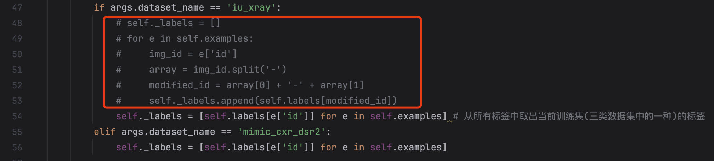
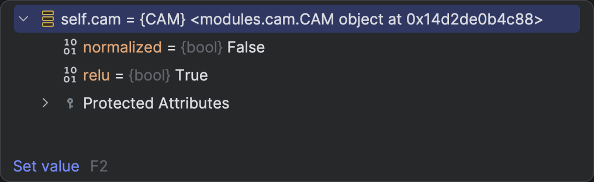
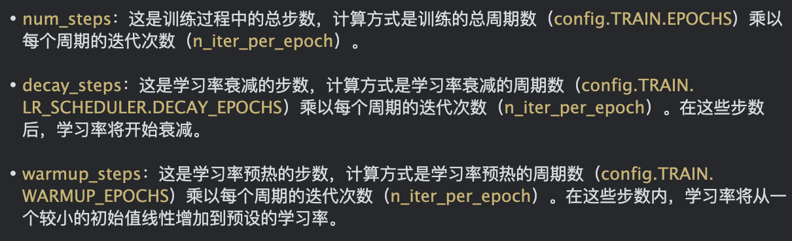
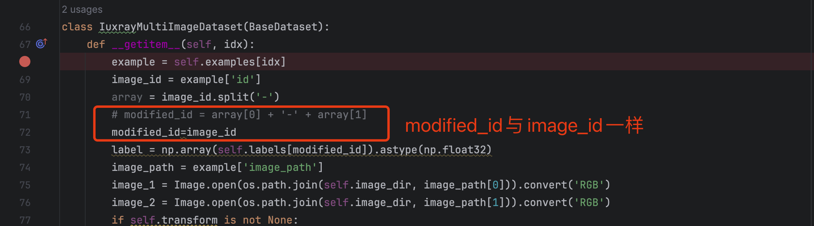
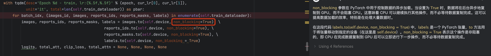
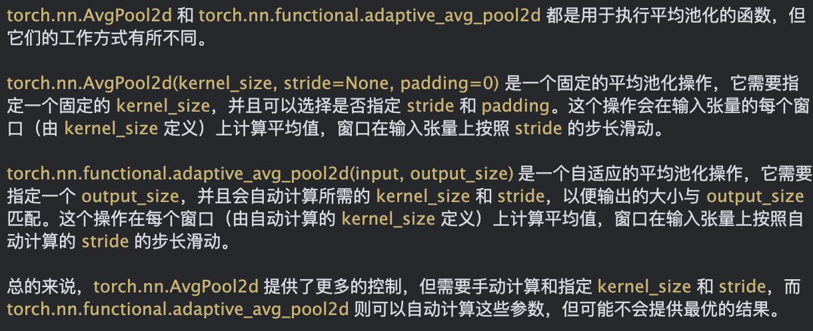
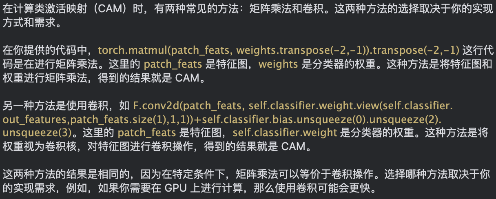
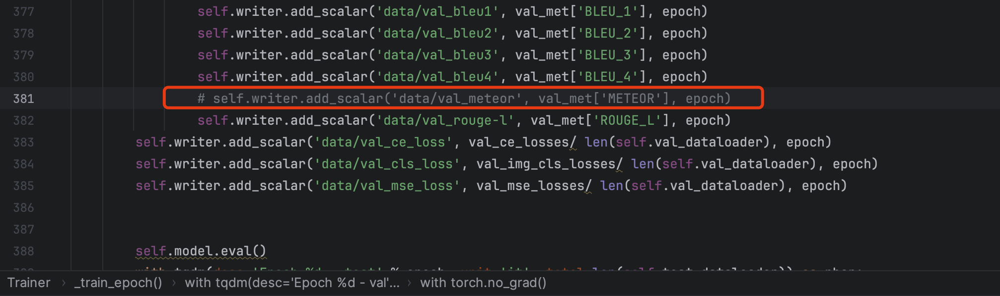
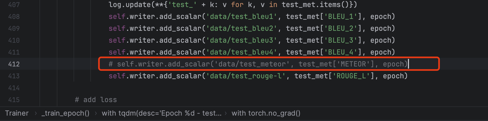
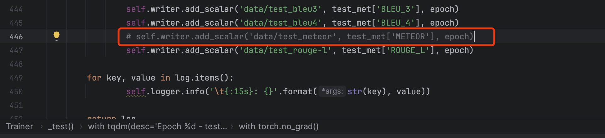

# 1环境配置

1. 首先使用下述命令复制原先的虚拟环境，构建新的虚拟环境：`report_generation_for_CAMANET`；

   1. ```
      conda create --name report_generation_for_CAMANET --clone report_generation_for_M2KT
      ```

2. 安装一些额外的包

   1. ```
      pip install opencv-python==4.5.5.64
      
      pip install timm
      
      pip install ml-collections==0.1.1
      
      pip install termcolor
      
      pip install tensorboard
      ```

3. 为main函数设置参数传递

   1. ```
      --exp_name CAMANET1
      --label_path /home/u2022110745/report_generation_for_M2KT_for_IU_school/report_generation_for_M2KT_own4/data/iu/r2gen_split/id_label.csv
      --dataset_name iu_xray
      --max_seq_length 60
      --threshold 3
      --batch_size 32
      --epochs 30
      --lr_ve 1e-3
      --lr_ed 2e-3
      --save_dir ./results/iu_xray
      --ve_name resnet101
      --ed_name r2gen
      --cfg configs/swin_tiny_patch4_window7_224.yaml
      --early_stop 10
      --weight_decay 5e-5
      --optim Adam
      --decay_epochs 50
      --warmup_epochs 0
      --warmup_lr 1e-4
      --lr_scheduler step
      --decay_rate 0.8
      --seed 2401
      --addcls
      --cls_w 1
      --fbl
      --attn_cam
      --attn_method max
      --topk 0.25
      --layer_id 2
      --mse_w 0.15
      --data_dir /home/u2022110745/report_generation_for_M2KT_for_IU_school/report_generation_for_M2KT_own4/data/iu/images/iu_2image
      ```

# 2调试

## 2.0疑惑点

1. <a href="#anchor1">解码前，为什么去除掉编码器的输出的第一个元素</a>；【已解决】
2. <a href="#anchor2">解码结束之后，返回hidden_states[:, 0]，此时的第一列已经不是前景特征表示了啊，为什么还作为前景特征表示了呢</a>;

## 2.2调试细节

> 1. 这篇文章的参数配置为`modules/utils.py`中的`parse_args`函数；

### 2.2.1分词器

1. 通过比对代码，这个论文使用的分词器和M2KT一样

### 2.2.2数据加载器的初始化

1. 数据加载器的内容基本一致，只是增加了一部分额外的内容
2. 增加了`self.vis`、`args.randaug`、`args.balanced`、`args.cls`参数
   1. `args.randaug`参数默认为`False`，所以这篇文章对训练集做的增强少了一个随机仿射变换`RandomAffine`；对测试集和验证集的增强少了`CenterCrop`；另外，对图像的标准化`transforms.Normalize`的具体数值略有差异；
   2. `args.cls`参数默认为`False`，所以在创建IU数据集时，这里的调用代码是一样的；数据集的初始化细节有所不同，详见**`2.2.2.1数据集的初始化`**；
   3. `args.balanced`参数默认为`False`，所以这篇文章多了`drop_last`和`prefetch_factor`参数，分别用于①如果为`True`，那么数据加载器将丢弃最后一个不完整的批次②每个工作进程可以预取的批次数量。

#### 2.2.2.1IU数据集的初始化

1. 这篇文章的数据集初始化函数（如`IuxrayMultiImageDataset`类的初始化函数）就是继承自`BaseDataset`的初始化函数，没有额外的初始化操作；

2. 在`BaseDataset`类中，增加了对标签的读取（这篇文章事先抽取了标签文件，并保存为了json格式），做了如下修改：

   1. 增加参数配置：`--data_dir /home/u2022110745/report_generation_for_M2KT_for_IU_school/report_generation_for_M2KT_own4/data/iu/images/iu_2image`；

   2. 修改参数配置为：`--label_path /home/u2022110745/report_generation_for_M2KT_for_IU_school/report_generation_for_M2KT_own4/data/iu/r2gen_split/id_label.csv`；

   3. 在`Tokenizer`类的`__init__`函数中，将`self.ann_path`修改为`self.ann_path = os.path.join(args.data_dir,  'annotation.json')`；

   4. 在`BaseDataset`类的`__init__`函数中，修改`self.image_dir`和`self.ann_path`为：

      1. ```python
         self.image_dir = os.path.join(args.data_dir,  'images')
         self.ann_path = os.path.join(args.data_dir,  'annotation.json')
         ```

   5. 在`BaseDataset`类的`__init__`函数中，将`self.labels_path`修改为`self.labels_path = args.label_path`；删除`self.labels = json.loads(open(self.labels_path, 'r').read())`；

   6. 由于这篇文章在`BaseDataset`类的`__init__`函数中还有一些额外操作，所以为了不影响后续的正常操作；在`BaseDataset`类的`__init__`函数中，增加一个`_load_data`函数，同时修改`self.labels`：

      1. ```python
         def _load_data(label_path):
             # 字典中的键是id，值是一个长度为14的列表，列表中的元素是0或1
             label_dict = {}
         
             data = pd.read_csv(label_path)
             for index, row in data.iterrows():
                 idx = row['id']
                 label = row[1:].tolist()
                 # map()将一个函数应用于一个可迭代对象的所有元素，并返回一个新的可迭代对象
                 # 如果对于某个观察结果是1，则当前id对应的这个观察结果的标签值就是1，其他的情况(包括不确定、0、空值)都是0
                 label_dict[idx] = list(map(lambda x: 1 if x == 1.0 else 0, label))
         
             return label_dict
         
         self.labels = _load_data(self.labels_path)
         ```

   7. 这篇文章使用的数据集，其`annotation.json`文件中存在这样的病人标识符：`CXR2372_IM-0933-0001`，而在标签文件中只有`CXR2372_IM-0933`，所以这篇文章多了下图红框所示的内容；但是我已经将其使用的数据集换成了我使用的标注和标签文件，所以可以将其注释掉，换成红框下面那一行的代码：

      

### 2.2.3模型初始化

#### 2.2.3.1视觉特征提取器的初始化

1. 使用的提取器是`densenet121`，将其换成`resnet101`；即修改参数配置：`--ve_name resnet101`；
2. 修改成`resnet101`之后，其余内容就基本一样，唯一不同的是这篇文章多了一个`CAM`类（即多了语句`self.cam = CAM()`），详见**`2.2.3.1.1CAM类初始化`**；

##### 2.2.3.1.1CAM类初始化

1. 初始化没有做什么工作，直接按照这个CAM类的默认参数进行了初始化，得到如下图所示的`cam`类实例对象，其中两个变量都是布尔型：

   

#### 2.2.3.2前景图和背景图模块初始化

> 1. 即`old_forebacklearning.py`文件中的`ForeBackLearning`类；
> 2. 由`args.fbl`参数控制，默认会初始化

1. 默认参数下，这个模块会创建两个标准化层`fore_norm`和`back_norm`，它们都是`norm`的深拷贝。
2. 而`norm`即为`LayerNorm(self.visual_extractor.num_features)`，
   1. 其中`LayerNorm`类与我实验的层标准化完全一样
   2. 这里传入的`visual_extractor.num_features`为`2048`；
3. 在获取CAM之后，这两个标准化层用于对前景特征表示和背景特征表示进行标准化

#### 2.2.3.3CAM注意力模块初始化

1. 默认参数下会初始化CAM注意力模块：使用的是`args.attn_method=max`方法，`args.topk=0.25`，`args.layer_id=2`，`args.vis=False`；

#### 2.2.3.4编码器解码器初始化

> 1. `args.ed_name`参数默认为`r2gen`，即默认使用`r2gen`的编码器解码器结构
> 2. 编码器解码器结构大体相同，区别主要在以下几点

1. 这篇文章中，在`my_encoder_decoder.py`中的`EncoderDecoder`类的`make_model`方法中，额外有一个`RelationalMemory`类的实例构建
   1. `RelationalMemory`类通过注意力机制和多层感知机对输入数据进行处理，并更新模型的记忆
   2. `RelationalMemory`类的实例用于解码器中，去形成记忆矩阵（即出现在了`my_encoder_decoder.py`中的`Transformer`类的`decode`函数中）
2. 另外，这篇文章的解码器结构中，使用的层规范化是条件层规范化，即使用的是`ConditionalLayerNorm`，从而使用的残差连接是条件残差连接，即`ConditionalSublayerConnection`；
   1. 编码器是一般的层规范化，即`LayerNorm`；
   1. N个解码器层之后，对结果进行规范化时，仍然用的是普通的层规范化；

### 2.2.4优化器与调度器

1. 优化器方面：使用的都是`Adam`，只有学习率有区别；这篇文章中，视觉特征提取器的学习率是`0.001`，其余部分的学习率是`0.002`

2. 调度器方面，这篇文章：

   1. 默认使用`StepLRScheduler`
   2. 默认不进行`warmup`和`decay`
   3. 使用的是`timm.scheduler.step_lr`的`StepLRScheduler`，而不是pytorch中提供的

   

### 2.2.5其他训练前准备工作

1. 默认从头开始训练模型，不使用之前训练好的模型权重继续训练

2. 会打印所有需要进行梯度更新的参数，通过如下语句实现：

   1. ```python
      n_parameters = sum(p.numel() for p in model.parameters() if p.requires_grad)
      ```

3. 损失计算：只包含基本的模型预测输出与真实文本之间的交叉熵损失，

4. 评价指标：这篇文章还计算了`METEOR`，其他都一样


### 2.2.6训练初始化

> 1. 主要是`BaseTrainer`类的初始化
> 2. 区别主要体现在损失上
> 3. M2KT损失的定义是全部放在了`compute_loss`函数中，而这篇论文将基本的损失之外的其他损失在这里进行了初始化

1. 这篇文章有一个多标签分类的`BCEWithLogitsLoss`，即二元交叉熵损失；由参数`args.addcls`控制，默认有这个损失；
2. 这篇文章还有一个均方误差损失`Weighted_MSELoss`，默认不加权；这个损失是与CAM有关的

### 2.2.7训练过程

1. 进入训练过程中，每次训完之后，检查是否提升等，这些操作跟M2KT的实验基本一致，不同点在于：
   1. 评判准则变了：这篇文章是`val_BLEU_4+0.5*val_BLEU_1`的值与当前最好的值作比较；而M2KT是直接用`val_BLEU_4`的值进行比较的；

#### 2.2.7.1读取一批数据

1. 在`2.2.2.1IU数据集的初始化`中，提到这篇文章数据集的特殊性，所以需要对读取进来的标签进行split操作；这里做如下修改：

   

2. 另外，这篇文章在使用IU数据集时，也是默认使用两张图像的；

3. IU数据集的`__getitem__`方法，除了上述两条区别之外，其他都一样。

4. 在数据加载器的`collate_fn`方法中，这篇文章没有什么不同；

5. 数据读取之后转移到GPU时，这篇文章使用了参数`non_blocking`，关于该参数的作用如下图所示：

   


#### 2.2.7.2使用视觉特征提取器提取图像特征

1. 由于IU数据集这里使用两张图像，因此需要分别计算各自的特征、平均池化的特征，然后将两个图像的特征concat，作为总的图像特征，将两个图像的平均池化特征进行平均，得到综合的平均池化特征；最终得到的结果；

   1. 这篇文章在计算两张图像各自`avg_feats`时使用的是`adaptive_avg_pool2d`，关于这个池化函数和`torch.nn.AvgPool2d`的区别如下图所示：

      

2. 由于`addcls`默认为`True`，因此会构建一个分类器；

3. 然后基于总的图像特征、分类器权重，构建CAM

   1. 这篇文章使用矩阵乘法来初步计算CAM：

      

   2. 然后在CAM上施加一个relu激活函数，用于将CAM中的负贡献值置为0（因为计算类激活图时将所有类别都考虑进来了，有些类别是没有贡献的）；

   3. 然后进行最大最小标准化

#### 2.2.7.3前景图和背景图计算

> 1. 主要根据CAM计算前景图和背景图，之后计算前景特征图和背景特征图，并将前景特征图与原始视觉特征合并在一起；

1. 根据视觉特征提取器中的分类器的预测结果，计算预测的类别标签`labels`，然后从CAM中筛选出预测类别的CAM，其他其他不在预测结果里面的类别对应的类激活图将会被置为0；
2. 基于筛选出来的类激活图，计算每个空间位置在14个类别上的最大cam值，得到所谓的前景图，维度是`[32,1,98]`；将此前景图归一化之后作为权重，乘到原始视觉特征上，得到前景特征表示`fore_rep`，维度是`[32,1,2048]`；同理得背景特征表示（模型不需要关注的其他区域）；
   1. 这个前景特征表示相当于得出模型此次关注的图像异常区域
3. 最后，将前景特征表示与原始视觉特征级联在一起，作为总的视觉特征，维度是`[32,99,2048]`；

#### 2.2.7.4编码器解码器的前向计算

> 1. 位于`my_encoder_decoder.py`的`EncoderDecoder`类的`_forward`方法中；
> 2. 核心的编码器解码器计算过程位于`my_encoder_decoder.py`的`Transformer`类的`forward`方法中；

1. 首先是特征的一些处理，即`_prepare_feature_forward`函数，与M2KT不同的地方在于：①调用`pack_wrapper`对视觉特征进行嵌入时，这篇文章还使用了ReLU激活函数②在对目标序列seq进行处理时，这篇文章将最后一个结束符的位置删除掉了；相应的，`seq_mask`的维度就发生了变化；
2. 其次，就是调用编码器解码器中的编码器结构对视觉特征进行编码，整个编码过程与M2KT是一样的；
3. 接着，在解码之前，需要计算`memory`
   1. 每一批次的数据所使用的`memory`都是需要重新初始化的
   2. 之后，根据目标序列的序列长度，依次遍历目标序列的每一个位置上的特征
      1. 每次循环中，利用注意力机制，结合输入门和遗忘门机制，更新`memory`
      2. `memory`每次更新，都是考虑了目标序列中当前位置的信息以及过往的信息（即目标序列中之前的位置的信息）
   3. 循环结束，将在每个位置上计算得到的`memory`堆叠起来，最终的维度是`[32,59,1536]`，即`[32,59,3*512]`；
4. 同时，<a id="anchor1"><font color="red">在解码前，去除掉编码器的输出的第一个元素，这里不太明白为什么要这么做，视觉特征也没有在开始位置做什么处理啊</font></a>？
   1. 在编码前，将前景特征表示合并进来，合并时作为第一列；参与过编码之后，在解码前将前景特征表示去掉，不参与解码；
5. 接着，进入解码环节
   1. `self_attn`、`src_attn`、`feed_forward`都是和M2KT一致
   2. 不同的是这里每个计算完之后(如`self_attn`)都会使用条件层规范化，即结合前面计算的`memory`(一批数据的`memory`)进行规范化
   3. 计算完成之后，除了返回目标序列嵌入的计算结果外，还返回了每个解码器层计算时的`src_attn`的注意力权重（即评分矩阵softmax之后的权重值）
6. 然后，返回解码器的计算结果（先使用对数softmax进行概率转换）、`hidden_states`的第一列值（作为前景图的编码结果）、目标序列的嵌入值以及每个解码器层计算时的`src_attn`的注意力权重
   1. <a id="anchor2"><font color="red">解码前`hidden_states`第一列已经被剔除掉了，再返回`hidden_states[:, 0]`，此时的第一列已经不是前景特征表示了啊，为什么还作为前景特征表示了呢</font></a>？

#### 2.2.7.5基于CAM的注意力权重筛选和加权

> 1. 主函数位于`model.py`的`R2GenModel`类的`forward`方法中
> 2. 对注意力进行加权位于`cam_attn_con.py`的`forward`方法；

1. 获得解码器最后一个解码器层的注意力权重值，并对8个头的注意力权重值求平均，得到维度为`[32,59,98]`的`attns`；这个量表示：98个空间位置对目标序列(长度为59)中每个位置的贡献，即权重
2. 目标文本本就是对图像的解读，前景表示是对图像中异常区域的突出；计算这两者之间的相似度`weights`，维度是`[32,59]`；并将无效的位置的相似度值置为`-1`；
3. 利用relu激活函数，给注意力权重值`attns`乘上相似度值`weights`，并将负值置为`0`，从而只保留了有效位置的注意力权重值；
4. 计算每条数据的有效长度，并从`attns`中选取前`topk`个位置(这里的位置指的是目标序列中的位置，这篇文章`topk`默认是`0.25`)；然后计算每个空间位置在这`topk`个位置上的最大值，经过最大最小规范化后，作为`total_attn`；维度是`[32,98]`；
   1. 这个`total_attn`可以理解为：剔除掉目标序列的填充位置，筛选出与真实报告文本最相近的那些注意力权值，而且还是前`topk`个；

### 2.2.8损失计算

1. 使用模型的预测输出与真实的报告文本计算基础的损失，即交叉熵损失；
2. 使用视觉特征提取器中分类器对图像特征的标签预测结果，计算标签损失，即图像分类损失，并累加到总的损失上去；
3. `fore_map`是模型对图像的需要重点关注区域的提取；`total_attn`是模型对文本的重点关注区域的提取；计算两者之间的均方误差，并累加到总的损失上去；

### 2.2.9验证和测试过程

1. 在验证集上，首先和在训练集上一样，设置`mode='train'`，获得编码器解码器结构的输出，用于计算在验证集上的①图像分类损失②基础的交叉熵损失③均方误差损失
2. 然后，设置`mode='sample'`，计算模型输出，并最终与真实报告文本进行比较，计算评价指标值
3. 在测试集上，没有去计算三种损失值，直接设置`mode='sample'`，计算模型输出，并最终与真实报告文本进行比较，计算测试集上的评价指标值

# 3因为警告或错误进行的代码调整

1. `weighted_mesloss.py`中的`Weighted_MSELoss`类的`forward`函数中，使用`nonzero`计算非零元素索引时，由于`pytorch`版本原因，需要进行更改：
   1. 原语句：`index = (scale != 0).nonzero().squeeze(-1) # 统计非零元素的索引`；
   2. 修改后：`index=torch.nonzero((scale != 0),as_tuple=False).squeeze(-1)`；

2. `caption_model.py`中的`beam_search`函数中的`beam_step`函数，使用`div()`除法的时候，由于`pytorch`版本原因，需要进行更改：
   1. 原语句：`beam_ix = torch.div(ix, vocab_size, rounding_mode = 'floor')`；
   2. 修改后：`beam_ix = torch.floor_divide(ix, vocab_size)`；

3. 在运行时，报错，提示缺少java，之后又出现`BrokenPipeError: [Errno 32] Broken pipe`错误，因此作出如下修改（即去掉有关METEOR指标的计算的代码）<a name="anchor3"></a>：

   1. 在`metrics.py`文件的`compute_scores`函数中，注释掉`(Meteor(), "METEOR"),`语句；

   2. 在`trainer.py`文件的`BaseTrainer`类的`_record_best`函数中，将测试集上`cur_metric`的计算去掉`0.5 * log['test_METEOR']`，改成和验证集上一样，即修改为：`cur_metric = log['test_BLEU_4'] +  0.5 * log['test_BLEU_1']`；

   3. 在`trainer.py`文件的`Trainer`类的`_train_epoch`方法中，注释掉验证集和测试集部分向tensorboard写入`METEOR`的语句，如下图所示：

      

      

   4. 同理，注释掉`trainer.py`文件的`_test`方法中的这个语句，如下图所示：

      
